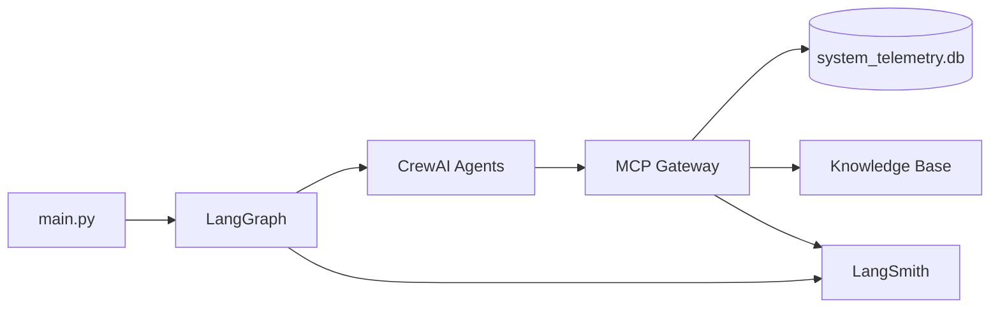

# Sentinel v2.0 — Autonomous System Health Guardian

Intelligent multi-agent monitoring for a cloud-native platform. Sentinel detects anomalies, diagnoses root causes via RAG, proposes safe remediation, and answers natural-language questions over operational telemetry (NL2SQL).

## Architecture

| Layer | Technology |
|-------|------------|
| Agents | CrewAI (Monitor, Diagnostician, Remediation, Data Intelligence) |
| Workflow | LangGraph circular self-healing loop |
| Gateway | MCP server (sole entry point for system interaction) |
| LLM | Groq (GPT OSS 120B for NL2SQL; lighter model for heal loop) |
| Observability | LangSmith |

**Self-healing loop:** `Monitor -> Diagnose -> Remediate -> Verify`  
If verification fails, a `retry` flag is set and control returns to **Diagnose**.

All system access goes through the MCP gateway:

- `get_system_logs()`
- `execute_system_command()` (simulated / read-only)
- `query_knowledge_base()`
- `query_database(nl_query)` (NL2SQL)



## Setup (separate environment)

**Requires Python 3.10–3.13** (CrewAI does not support 3.14).

```powershell
cd "d:\AiML Projects\crewAI"
py -3.11 -m venv .venv
.\.venv\Scripts\Activate.ps1
pip install -r requirements.txt
copy .env.example .env
```

Edit `.env`:

| Variable | Purpose |
|----------|---------|
| `GROQ_API_KEY` | Free key from [console.groq.com/keys](https://console.groq.com/keys) |
| `GROQ_MODEL` | NL2SQL model (default: `openai/gpt-oss-120b`) |
| `GROQ_AGENT_MODEL` | Heal-loop model (default: `llama-3.1-8b-instant`) |
| `LANGCHAIN_API_KEY` | Free key from [smith.langchain.com](https://smith.langchain.com) |
| `LANGCHAIN_PROJECT` | Must match your LangSmith project name (default: `sentinel-v2`) |

Initialize the telemetry database:

```powershell
python main.py init-db
```

### Groq model notes

- Use the full Groq API id for GPT OSS 120B: **`openai/gpt-oss-120b`** (not `gpt-oss-120b` alone).
- The heal loop uses a lighter agent model to avoid GPT OSS 120B free-tier TPM limits (8k tokens/min).
- NL2SQL and the Data Intelligence agent use `GROQ_MODEL`.

## LangSmith setup (assignment screenshot)

1. Sign up at [https://smith.langchain.com](https://smith.langchain.com)
2. Create a tracing project named **`sentinel-v2`** (must match `LANGCHAIN_PROJECT` in `.env`)
3. Go to **Settings -> API Keys** and copy your key into `.env`:

```env
LANGCHAIN_TRACING_V2=true
LANGCHAIN_API_KEY=lsv2_...
LANGCHAIN_PROJECT=sentinel-v2
LANGCHAIN_ENDPOINT=https://api.smith.langchain.com
```

4. Run an NL2SQL query (generates a trace):

```powershell
python main.py nl2sql --direct "Which servers have CPU above 90?"
```

5. In LangSmith, open project **`sentinel-v2`** (not "My First App") -> **Tracing**
6. Open the latest run and screenshot the span showing natural language translated to SQL (`nl2sql_generate` / `query_database`)

## Usage

```powershell
# Self-healing loop (Monitor -> Diagnose -> Remediate -> Verify, with retry demo)
python main.py heal

# Skip forced first verification failure
python main.py heal --no-forced-retry

# Natural language -> SQL (Data Intelligence Agent via CrewAI)
python main.py nl2sql "Which servers have CPU above 90?"

# Direct MCP NL2SQL path (best for LangSmith NL->SQL trace)
python main.py nl2sql --direct "Which servers have CPU above 90?"

# Graceful degradation (out-of-scope question)
python main.py nl2sql "What is the CEO's favorite color?"

# Re-seed database
python main.py init-db

# Run MCP server standalone (stdio)
python main.py mcp
```

## Safety guardrails

The Remediation path blocks **high-risk** commands (`system_reboot`, `force_kill_db`, etc.) when any server reports `db_load >= 80`. Safer alternatives (`clear_cache`, `scale_up`, `flush_connections`) remain allowed.

During the heal loop, a blocked `system_reboot` demonstrates the guardrail in action.

## Project layout

```
crewAI/
├── main.py                 # CLI entry point
├── config.py               # env, models, LangSmith, schema
├── agents/                 # Four CrewAI agents + Groq LLM wrapper
├── workflow/
│   ├── graph.py            # LangGraph circular loop
│   └── agent_runner.py     # Heal-loop summarizer (MCP-first)
├── mcp_server/
│   ├── gateway.py          # Tool implementations (shared by MCP + agents)
│   └── server.py           # FastMCP stdio server
├── tools/                  # CrewAI tools wrapping MCP gateway
├── data/
│   ├── system_telemetry.db # SQLite telemetry (seeded by init-db)
│   └── knowledge_base/     # RAG runbooks
└── scripts/init_db.py
```

## Requirements coverage

| Requirement | Implementation |
|-------------|----------------|
| A. Four specialized agents | `agents/` |
| B. DB + NL2SQL + graceful degradation | `data/system_telemetry.db`, `query_database` |
| C. LangGraph circular loop + retry | `workflow/graph.py` |
| D. MCP-only gateway (4 tools) | `mcp_server/` |
| E. Safety guardrails + LangSmith | remediation checks + tracing env |

## Troubleshooting

| Problem | Fix |
|---------|-----|
| LangSmith shows nothing | Project name in UI must match `LANGCHAIN_PROJECT` (`sentinel-v2`) |
| `cache_breakpoint` Groq error | Already handled in `agents/llm.py` (`GroqLLM` wrapper) |
| `gpt-oss-120b` model not found | Use `openai/gpt-oss-120b` in `.env` |
| Groq rate limit on `heal` | Keep `GROQ_AGENT_MODEL=llama-3.1-8b-instant`; heal uses MCP-first flow |
| CrewAI install fails | Use `py -3.11`, not system Python 3.14 |
| Unicode errors in Windows terminal | CLI uses ASCII arrows; avoid emoji in console output |

## Example NL2SQL output

```json
{
  "nl_query": "Which servers have CPU above 90?",
  "sql": "SELECT hostname FROM servers WHERE cpu_pct > 90",
  "row_count": 3,
  "rows": [
    {"hostname": "web-02.us-east"},
    {"hostname": "api-01.us-west"},
    {"hostname": "worker-01.us-east"}
  ]
}
```
